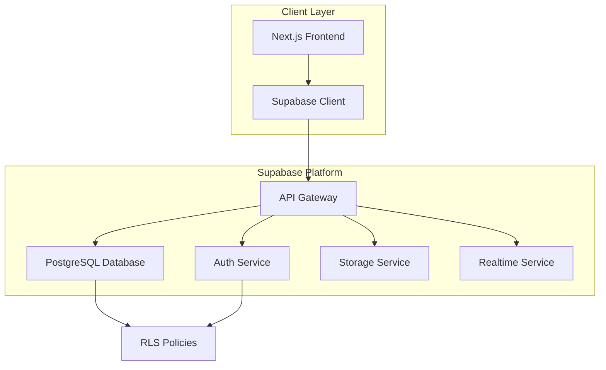

# Design Document

## Overview

This design document outlines the architecture for integrating a complete backend system with the existing bucket list frontend application. The solution leverages Supabase as the Backend-as-a-Service (BaaS) platform, providing PostgreSQL database, authentication, real-time subscriptions, and storage capabilities. The design follows a serverless architecture pattern where the frontend communicates directly with Supabase services, eliminating the need for a custom API server while maintaining security through Row Level Security (RLS) policies.

### Technology Stack

- **Database**: Supabase PostgreSQL with Row Level Security
- **Authentication**: Supabase Auth with email/password and social providers
- **Storage**: Supabase Storage for memory photos
- **API**: Auto-generated REST and Realtime APIs from Supabase
- **Frontend**: Next.js 15 with TypeScript and React 19
- **Client Library**: @supabase/supabase-js

## Architecture

### High-Level Architecture



### Database Architecture

The database follows a relational model with the following key principles:

1. **User-Centric Design**: All data is associated with users through foreign keys
2. **Normalized Structure**: Separate tables for distinct entities to avoid data duplication
3. **Referential Integrity**: Foreign key constraints ensure data consistency
4. **Soft Deletes**: Critical data uses soft delete patterns for data recovery
5. **Audit Trails**: Timestamps track creation and modification times

### Security Architecture

Security is implemented at multiple layers:

1. **Authentication Layer**: Supabase Auth manages user sessions and JWT tokens
2. **Authorization Layer**: RLS policies enforce data access rules at the database level
3. **API Layer**: API Gateway validates JWT tokens before forwarding requests
4. **Storage Layer**: Storage policies control file upload and access permissions

## Components and Interfaces

### Database Schema

#### Core Tables

**users (managed by Supabase Auth)**
- Supabase Auth automatically manages the `auth.users` table
- Contains: id (uuid), email, encrypted_password, email_confirmed_at, etc.

**profiles**
```sql
CREATE TABLE public.profiles (
  id UUID PRIMARY KEY REFERENCES auth.users(id) ON DELETE CASCADE,
  username TEXT UNIQUE NOT NULL,
  avatar_url TEXT,
  bio TEXT,
  total_points INTEGER DEFAULT 0,
  global_rank INTEGER,
  items_completed INTEGER DEFAULT 0,
  lists_following INTEGER DEFAULT 0,
  lists_created INTEGER DEFAULT 0,
  created_at TIMESTAMPTZ DEFAULT NOW(),
  updated_at TIMESTAMPTZ DEFAULT NOW(),
  
  CONSTRAINT username_length CHECK (char_length(username) >= 3 AND char_length(username) <= 30),
  CONSTRAINT bio_length CHECK (char_length(bio) <= 500)
);
```

**bucket_lists**
```sql
CREATE TABLE public.bucket_lists (
  id UUID PRIMARY KEY DEFAULT gen_random_uuid(),
  user_id UUID NOT NULL REFERENCES auth.users(id) ON DELETE CASCADE,
  name TEXT NOT NULL,
  description TEXT,
  category TEXT NOT NULL,
  is_public BOOLEAN DEFAULT true,
  follower_count INTEGER DEFAULT 0,
  created_at TIMESTAMPTZ DEFAULT NOW(),
  updated_at TIMESTAMPTZ DEFAULT NOW(),
  
  CONSTRAINT name_length CHECK (char_length(name) >= 3 AND char_length(name) <= 100),
  CONSTRAINT valid_category CHECK (category IN (
    'adventures', 'places', 'cuisines', 'books', 
    'songs', 'monuments', 'acts-of-service', 'miscellaneous'
  ))
);

CREATE INDEX idx_bucket_lists_user_id ON public.bucket_lists(user_id);
CREATE INDEX idx_bucket_lists_category ON public.bucket_lists(category);
CREATE INDEX idx_bucket_lists_is_public ON public.bucket_lists(is_public);
```

**bucket_items**
```sql
CREATE TABLE public.bucket_items (
  id UUID PRIMARY KEY DEFAULT gen_random_uuid(),
  bucket_list_id UUID NOT NULL REFERENCES public.bucket_lists(id) ON DELETE CASCADE,
  title TEXT NOT NULL,
  description TEXT,
  points INTEGER NOT NULL DEFAULT 50,
  difficulty TEXT,
  location TEXT,
  completed BOOLEAN DEFAULT false,
  completed_date TIMESTAMPTZ,
  created_at TIMESTAMPTZ DEFAULT NOW(),
  updated_at TIMESTAMPTZ DEFAULT NOW(),
  
  CONSTRAINT title_length CHECK (char_length(title) >= 3 AND char_length(title) <= 200),
  CONSTRAINT points_range CHECK (points >= 1 AND points <= 1000),
  CONSTRAINT valid_difficulty CHECK (difficulty IN ('easy', 'medium', 'hard'))
);

CREATE INDEX idx_bucket_items_list_id ON public.bucket_items(bucket_list_id);
CREATE INDEX idx_bucket_items_completed ON public.bucket_items(completed);
```

**memories**
```sql
CREATE TABLE public.memories (
  id UUID PRIMARY KEY DEFAULT gen_random_uuid(),
  user_id UUID NOT NULL REFERENCES auth.users(id) ON DELETE CASCADE,
  bucket_item_id UUID NOT NULL REFERENCES public.bucket_items(id) ON DELETE CASCADE,
  reflection TEXT NOT NULL,
  photos JSONB DEFAULT '[]'::jsonb,
  is_public BOOLEAN DEFAULT true,
  created_at TIMESTAMPTZ DEFAULT NOW(),
  updated_at TIMESTAMPTZ DEFAULT NOW(),
  
  CONSTRAINT reflection_length CHECK (char_length(reflection) >= 10 AND char_length(reflection) <= 5000)
);

CREATE INDEX idx_memories_user_id ON public.memories(user_id);
CREATE INDEX idx_memories_item_id ON public.memories(bucket_item_id);
CREATE INDEX idx_memories_is_public ON public.memories(is_public);
```

**list_followers**
```sql
CREATE TABLE public.list_followers (
  id UUID PRIMARY KEY DEFAULT gen_random_uuid(),
  user_id UUID NOT NULL REFERENCES auth.users(id) ON DELETE CASCADE,
  bucket_list_id UUID NOT NULL REFERENCES public.bucket_lists(id) ON DELETE CASCADE,
  created_at TIMESTAMPTZ DEFAULT NOW(),
  
  UNIQUE(user_id, bucket_list_id)
);

CREATE INDEX idx_list_followers_user_id ON public.list_followers(user_id);
CREATE INDEX idx_list_followers_list_id ON public.list_followers(bucket_list_id);
```

**timeline_events**
```sql
CREATE TABLE public.timeline_events (
  id UUID PRIMARY KEY DEFAULT gen_random_uuid(),
  user_id UUID NOT NULL REFERENCES auth.users(id) ON DELETE CASCADE,
  event_type TEXT NOT NULL,
  title TEXT NOT NULL,
  description TEXT,
  metadata JSONB DEFAULT '{}'::jsonb,
  is_public BOOLEAN DEFAULT true,
  created_at TIMESTAMPTZ DEFAULT NOW(),
  
  CONSTRAINT valid_event_type CHECK (event_type IN (
    'item_completed', 'memory_uploaded', 'memory_shared',
    'list_created', 'list_followed', 'achievement_unlocked'
  ))
);

CREATE INDEX idx_timeline_events_user_id ON public.timeline_events(user_id);
CREATE INDEX idx_timeline_events_type ON public.timeline_events(event_type);
CREATE INDEX idx_timeline_events_created_at ON public.timeline_events(created_at DESC);
CREATE INDEX idx_timeline_events_is_public ON public.timeline_events(is_public);
```

#### Database Views

**leaderboard_view**
```sql
CREATE VIEW public.leaderboard_view AS
SELECT 
  p.id,
  p.username,
  p.avatar_url,
  p.total_points,
  p.global_rank,
  p.items_completed,
  RANK() OVER (ORDER BY p.total_points DESC) as current_rank
FROM public.profiles p
ORDER BY p.total_points DESC;
```

**user_feed_view**
```sql
CREATE VIEW public.user_feed_view AS
SELECT 
  te.id,
  te.user_id,
  te.event_type,
  te.title,
  te.description,
  te.metadata,
  te.created_at,
  p.username,
  p.avatar_url
FROM public.timeline_events te
JOIN public.profiles p ON te.user_id = p.id
WHERE te.is_public = true
ORDER BY te.created_at DESC;
```

### Database Functions

**update_profile_stats**
```sql
CREATE OR REPLACE FUNCTION public.update_profile_stats(user_uuid UUID)
RETURNS void
LANGUAGE plpgsql
SECURITY DEFINER
SET search_path = public
AS $$
BEGIN
  UPDATE public.profiles
  SET 
    items_completed = (
      SELECT COUNT(*)
      FROM public.bucket_items bi
      JOIN public.bucket_lists bl ON bi.bucket_list_id = bl.id
      WHERE bl.user_id = user_uuid AND bi.completed = true
    ),
    lists_created = (
      SELECT COUNT(*)
      FROM public.bucket_lists
      WHERE user_id = user_uuid
    ),
    lists_following = (
      SELECT COUNT(*)
      FROM public.list_followers
      WHERE user_id = user_uuid
    ),
    updated_at = NOW()
  WHERE id = user_uuid;
END;
$$;
```

**recalculate_global_ranks**
```sql
CREATE OR REPLACE FUNCTION public.recalculate_global_ranks()
RETURNS void
LANGUAGE plpgsql
SECURITY DEFINER
SET search_path = public
AS $$
BEGIN
  WITH ranked_users AS (
    SELECT 
      id,
      RANK() OVER (ORDER BY total_points DESC) as new_rank
    FROM public.profiles
  )
  UPDATE public.profiles p
  SET global_rank = ru.new_rank
  FROM ranked_users ru
  WHERE p.id = ru.id;
END;
$$;
```

**increment_follower_count**
```sql
CREATE OR REPLACE FUNCTION public.increment_follower_count()
RETURNS TRIGGER
LANGUAGE plpgsql
SECURITY DEFINER
SET search_path = public
AS $$
BEGIN
  UPDATE public.bucket_lists
  SET follower_count = follower_count + 1
  WHERE id = NEW.bucket_list_id;
  RETURN NEW;
END;
$$;

CREATE TRIGGER on_list_followed
  AFTER INSERT ON public.list_followers
  FOR EACH ROW
  EXECUTE FUNCTION public.increment_follower_count();
```

**decrement_follower_count**
```sql
CREATE OR REPLACE FUNCTION public.decrement_follower_count()
RETURNS TRIGGER
LANGUAGE plpgsql
SECURITY DEFINER
SET search_path = public
AS $$
BEGIN
  UPDATE public.bucket_lists
  SET follower_count = follower_count - 1
  WHERE id = OLD.bucket_list_id;
  RETURN OLD;
END;
$$;

CREATE TRIGGER on_list_unfollowed
  AFTER DELETE ON public.list_followers
  FOR EACH ROW
  EXECUTE FUNCTION public.decrement_follower_count();
```

**handle_item_completion**
```sql
CREATE OR REPLACE FUNCTION public.handle_item_completion()
RETURNS TRIGGER
LANGUAGE plpgsql
SECURITY DEFINER
SET search_path = public
AS $$
DECLARE
  list_owner_id UUID;
  item_points INTEGER;
BEGIN
  IF NEW.completed = true AND OLD.completed = false THEN
    -- Get the list owner and item points
    SELECT bl.user_id, NEW.points
    INTO list_owner_id, item_points
    FROM public.bucket_lists bl
    WHERE bl.id = NEW.bucket_list_id;
    
    -- Update user's total points
    UPDATE public.profiles
    SET 
      total_points = total_points + item_points,
      items_completed = items_completed + 1
    WHERE id = list_owner_id;
    
    -- Create timeline event
    INSERT INTO public.timeline_events (
      user_id, event_type, title, description, metadata
    ) VALUES (
      list_owner_id,
      'item_completed',
      'Completed: ' || NEW.title,
      'Earned ' || item_points || ' points',
      jsonb_build_object(
        'item_id', NEW.id,
        'points', item_points,
        'list_id', NEW.bucket_list_id
      )
    );
    
    -- Set completion date
    NEW.completed_date = NOW();
  END IF;
  
  RETURN NEW;
END;
$$;

CREATE TRIGGER on_item_completed
  BEFORE UPDATE ON public.bucket_items
  FOR EACH ROW
  EXECUTE FUNCTION public.handle_item_completion();
```

**handle_new_user**
```sql
CREATE OR REPLACE FUNCTION public.handle_new_user()
RETURNS TRIGGER
LANGUAGE plpgsql
SECURITY DEFINER
SET search_path = public
AS $$
BEGIN
  INSERT INTO public.profiles (id, username, avatar_url)
  VALUES (
    NEW.id,
    COALESCE(NEW.raw_user_meta_data->>'username', 'user_' || substr(NEW.id::text, 1, 8)),
    NEW.raw_user_meta_data->>'avatar_url'
  );
  RETURN NEW;
END;
$$;

CREATE TRIGGER on_auth_user_created
  AFTER INSERT ON auth.users
  FOR EACH ROW
  EXECUTE FUNCTION public.handle_new_user();
```

### Row Level Security Policies

**profiles table policies**
```sql
-- Enable RLS
ALTER TABLE public.profiles ENABLE ROW LEVEL SECURITY;

-- Anyone can view profiles
CREATE POLICY "Profiles are viewable by everyone"
  ON public.profiles FOR SELECT
  TO authenticated, anon
  USING (true);

-- Users can update their own profile
CREATE POLICY "Users can update own profile"
  ON public.profiles FOR UPDATE
  TO authenticated
  USING ((SELECT auth.uid()) = id)
  WITH CHECK ((SELECT auth.uid()) = id);
```

**bucket_lists table policies**
```sql
-- Enable RLS
ALTER TABLE public.bucket_lists ENABLE ROW LEVEL SECURITY;

-- Public lists are viewable by everyone
CREATE POLICY "Public lists are viewable by everyone"
  ON public.bucket_lists FOR SELECT
  TO authenticated, anon
  USING (is_public = true OR (SELECT auth.uid()) = user_id);

-- Users can insert their own lists
CREATE POLICY "Users can create own lists"
  ON public.bucket_lists FOR INSERT
  TO authenticated
  WITH CHECK ((SELECT auth.uid()) = user_id);

-- Users can update their own lists
CREATE POLICY "Users can update own lists"
  ON public.bucket_lists FOR UPDATE
  TO authenticated
  USING ((SELECT auth.uid()) = user_id)
  WITH CHECK ((SELECT auth.uid()) = user_id);

-- Users can delete their own lists
CREATE POLICY "Users can delete own lists"
  ON public.bucket_lists FOR DELETE
  TO authenticated
  USING ((SELECT auth.uid()) = user_id);
```

**bucket_items table policies**
```sql
-- Enable RLS
ALTER TABLE public.bucket_items ENABLE ROW LEVEL SECURITY;

-- Items are viewable if the list is accessible
CREATE POLICY "Items viewable if list is accessible"
  ON public.bucket_items FOR SELECT
  TO authenticated, anon
  USING (
    EXISTS (
      SELECT 1 FROM public.bucket_lists bl
      WHERE bl.id = bucket_list_id
      AND (bl.is_public = true OR bl.user_id = (SELECT auth.uid()))
    )
  );

-- Users can insert items to their own lists
CREATE POLICY "Users can add items to own lists"
  ON public.bucket_items FOR INSERT
  TO authenticated
  WITH CHECK (
    EXISTS (
      SELECT 1 FROM public.bucket_lists bl
      WHERE bl.id = bucket_list_id
      AND bl.user_id = (SELECT auth.uid())
    )
  );

-- Users can update items in their own lists
CREATE POLICY "Users can update items in own lists"
  ON public.bucket_items FOR UPDATE
  TO authenticated
  USING (
    EXISTS (
      SELECT 1 FROM public.bucket_lists bl
      WHERE bl.id = bucket_list_id
      AND bl.user_id = (SELECT auth.uid())
    )
  )
  WITH CHECK (
    EXISTS (
      SELECT 1 FROM public.bucket_lists bl
      WHERE bl.id = bucket_list_id
      AND bl.user_id = (SELECT auth.uid())
    )
  );

-- Users can delete items from their own lists
CREATE POLICY "Users can delete items from own lists"
  ON public.bucket_items FOR DELETE
  TO authenticated
  USING (
    EXISTS (
      SELECT 1 FROM public.bucket_lists bl
      WHERE bl.id = bucket_list_id
      AND bl.user_id = (SELECT auth.uid())
    )
  );
```

**memories table policies**
```sql
-- Enable RLS
ALTER TABLE public.memories ENABLE ROW LEVEL SECURITY;

-- Public memories are viewable by everyone, private only by owner
CREATE POLICY "Memories viewable based on privacy"
  ON public.memories FOR SELECT
  TO authenticated, anon
  USING (is_public = true OR (SELECT auth.uid()) = user_id);

-- Users can create their own memories
CREATE POLICY "Users can create own memories"
  ON public.memories FOR INSERT
  TO authenticated
  WITH CHECK ((SELECT auth.uid()) = user_id);

-- Users can update their own memories
CREATE POLICY "Users can update own memories"
  ON public.memories FOR UPDATE
  TO authenticated
  USING ((SELECT auth.uid()) = user_id)
  WITH CHECK ((SELECT auth.uid()) = user_id);

-- Users can delete their own memories
CREATE POLICY "Users can delete own memories"
  ON public.memories FOR DELETE
  TO authenticated
  USING ((SELECT auth.uid()) = user_id);
```

**list_followers table policies**
```sql
-- Enable RLS
ALTER TABLE public.list_followers ENABLE ROW LEVEL SECURITY;

-- Users can view their own follows
CREATE POLICY "Users can view own follows"
  ON public.list_followers FOR SELECT
  TO authenticated
  USING ((SELECT auth.uid()) = user_id);

-- Users can follow lists
CREATE POLICY "Users can follow lists"
  ON public.list_followers FOR INSERT
  TO authenticated
  WITH CHECK ((SELECT auth.uid()) = user_id);

-- Users can unfollow lists
CREATE POLICY "Users can unfollow lists"
  ON public.list_followers FOR DELETE
  TO authenticated
  USING ((SELECT auth.uid()) = user_id);
```

**timeline_events table policies**
```sql
-- Enable RLS
ALTER TABLE public.timeline_events ENABLE ROW LEVEL SECURITY;

-- Public events are viewable by everyone, private only by owner
CREATE POLICY "Timeline events viewable based on privacy"
  ON public.timeline_events FOR SELECT
  TO authenticated, anon
  USING (is_public = true OR (SELECT auth.uid()) = user_id);

-- Users can create their own events
CREATE POLICY "Users can create own events"
  ON public.timeline_events FOR INSERT
  TO authenticated
  WITH CHECK ((SELECT auth.uid()) = user_id);

-- Users can update their own events
CREATE POLICY "Users can update own events"
  ON public.timeline_events FOR UPDATE
  TO authenticated
  USING ((SELECT auth.uid()) = user_id)
  WITH CHECK ((SELECT auth.uid()) = user_id);

-- Users can delete their own events
CREATE POLICY "Users can delete own events"
  ON public.timeline_events FOR DELETE
  TO authenticated
  USING ((SELECT auth.uid()) = user_id);
```

### Storage Configuration

**Bucket: memory-photos**
```sql
-- Create storage bucket
INSERT INTO storage.buckets (id, name, public)
VALUES ('memory-photos', 'memory-photos', true);

-- Storage policies
CREATE POLICY "Users can upload their own photos"
  ON storage.objects FOR INSERT
  TO authenticated
  WITH CHECK (
    bucket_id = 'memory-photos' AND
    (storage.foldername(name))[1] = (SELECT auth.uid()::text)
  );

CREATE POLICY "Public photos are viewable by everyone"
  ON storage.objects FOR SELECT
  TO authenticated, anon
  USING (bucket_id = 'memory-photos');

CREATE POLICY "Users can update their own photos"
  ON storage.objects FOR UPDATE
  TO authenticated
  USING (
    bucket_id = 'memory-photos' AND
    (storage.foldername(name))[1] = (SELECT auth.uid()::text)
  );

CREATE POLICY "Users can delete their own photos"
  ON storage.objects FOR DELETE
  TO authenticated
  USING (
    bucket_id = 'memory-photos' AND
    (storage.foldername(name))[1] = (SELECT auth.uid()::text)
  );
```

### API Endpoints

The Supabase client provides auto-generated REST endpoints:

**Authentication Endpoints**
- `POST /auth/v1/signup` - Register new user
- `POST /auth/v1/token?grant_type=password` - Login
- `POST /auth/v1/logout` - Logout
- `POST /auth/v1/recover` - Password reset request
- `PUT /auth/v1/user` - Update user metadata

**Data Endpoints** (via PostgREST)
- `GET /rest/v1/profiles` - Get profiles
- `PATCH /rest/v1/profiles?id=eq.{id}` - Update profile
- `GET /rest/v1/bucket_lists` - Get bucket lists
- `POST /rest/v1/bucket_lists` - Create bucket list
- `PATCH /rest/v1/bucket_lists?id=eq.{id}` - Update bucket list
- `DELETE /rest/v1/bucket_lists?id=eq.{id}` - Delete bucket list
- `GET /rest/v1/bucket_items` - Get bucket items
- `POST /rest/v1/bucket_items` - Create bucket item
- `PATCH /rest/v1/bucket_items?id=eq.{id}` - Update bucket item
- `GET /rest/v1/memories` - Get memories
- `POST /rest/v1/memories` - Create memory
- `GET /rest/v1/timeline_events` - Get timeline events
- `GET /rest/v1/leaderboard_view` - Get leaderboard
- `POST /rest/v1/list_followers` - Follow list
- `DELETE /rest/v1/list_followers?id=eq.{id}` - Unfollow list

**Storage Endpoints**
- `POST /storage/v1/object/memory-photos/{user_id}/{filename}` - Upload photo
- `GET /storage/v1/object/public/memory-photos/{user_id}/{filename}` - Get photo
- `DELETE /storage/v1/object/memory-photos/{user_id}/{filename}` - Delete photo

### Frontend Integration

**Supabase Client Setup**
```typescript
// lib/supabase.ts
import { createClient } from '@supabase/supabase-js'
import { Database } from '@/types/supabase'

const supabaseUrl = process.env.NEXT_PUBLIC_SUPABASE_URL!
const supabaseAnonKey = process.env.NEXT_PUBLIC_SUPABASE_ANON_KEY!

export const supabase = createClient<Database>(supabaseUrl, supabaseAnonKey)
```

**Type Generation**
```bash
npx supabase gen types typescript --project-id <project-id> > types/supabase.ts
```

## Data Models

### TypeScript Interfaces

```typescript
// types/database.ts
export interface Profile {
  id: string
  username: string
  avatar_url: string | null
  bio: string | null
  total_points: number
  global_rank: number | null
  items_completed: number
  lists_following: number
  lists_created: number
  created_at: string
  updated_at: string
}

export interface BucketList {
  id: string
  user_id: string
  name: string
  description: string | null
  category: Category
  is_public: boolean
  follower_count: number
  created_at: string
  updated_at: string
}

export interface BucketItem {
  id: string
  bucket_list_id: string
  title: string
  description: string | null
  points: number
  difficulty: 'easy' | 'medium' | 'hard' | null
  location: string | null
  completed: boolean
  completed_date: string | null
  created_at: string
  updated_at: string
}

export interface Memory {
  id: string
  user_id: string
  bucket_item_id: string
  reflection: string
  photos: string[]
  is_public: boolean
  created_at: string
  updated_at: string
}

export interface TimelineEvent {
  id: string
  user_id: string
  event_type: TimelineEventType
  title: string
  description: string | null
  metadata: Record<string, any>
  is_public: boolean
  created_at: string
}

export interface ListFollower {
  id: string
  user_id: string
  bucket_list_id: string
  created_at: string
}
```

## Error Handling

### Error Response Format

```typescript
interface ApiError {
  code: string
  message: string
  details?: string
  hint?: string
}
```

### Error Codes

- `PGRST116` - Row not found (404)
- `23505` - Unique constraint violation (409)
- `23503` - Foreign key violation (409)
- `42501` - Insufficient privilege (403)
- `PGRST301` - JWT expired (401)

### Error Handling Strategy

```typescript
// lib/error-handler.ts
export function handleSupabaseError(error: any): ApiError {
  if (error.code === 'PGRST116') {
    return {
      code: '404',
      message: 'Resource not found'
    }
  }
  
  if (error.code === '23505') {
    return {
      code: '409',
      message: 'Resource already exists',
      details: error.details
    }
  }
  
  if (error.code === '42501') {
    return {
      code: '403',
      message: 'Insufficient permissions'
    }
  }
  
  return {
    code: '500',
    message: 'An unexpected error occurred',
    details: error.message
  }
}
```

## Testing Strategy

### Unit Testing

**Database Functions**
- Test each database function with various inputs
- Verify trigger behavior on insert/update/delete operations
- Test constraint validations

**RLS Policies**
- Test policies with different user roles (authenticated, anon)
- Verify users can only access authorized data
- Test edge cases (e.g., accessing deleted resources)

### Integration Testing

**API Endpoints**
- Test CRUD operations for each table
- Verify proper error responses
- Test pagination and filtering
- Test file upload and retrieval

**Authentication Flow**
- Test signup, login, logout flows
- Test password reset flow
- Test session management

### End-to-End Testing

**User Workflows**
- Create account → Create list → Add items → Complete items → Create memory
- Follow list → View feed → View leaderboard
- Update profile → View timeline

### Performance Testing

**Database Queries**
- Measure query execution times
- Test with large datasets (10k+ records)
- Verify index effectiveness

**API Response Times**
- Measure API endpoint response times
- Test concurrent user scenarios
- Monitor database connection pool usage

## Deployment Strategy

### Environment Setup

**Development**
- Local Supabase instance using Docker
- Seed data for testing

**Staging**
- Supabase project for staging
- Mirror production data structure
- Test migrations before production

**Production**
- Supabase production project
- Automated backups enabled
- Point-in-time recovery configured

### Migration Strategy

1. Create migration files using Supabase CLI
2. Test migrations in local environment
3. Apply to staging environment
4. Verify data integrity
5. Apply to production during maintenance window
6. Monitor for errors

### Rollback Plan

1. Keep previous migration version available
2. Test rollback procedure in staging
3. Document rollback steps
4. Monitor application after rollback

## Performance Optimization

### Database Optimization

1. **Indexes**: Create indexes on frequently queried columns
2. **Query Optimization**: Use `select` with specific columns instead of `*`
3. **Connection Pooling**: Configure appropriate pool size
4. **Caching**: Implement client-side caching for static data

### Frontend Optimization

1. **Data Fetching**: Use SWR or React Query for caching
2. **Pagination**: Implement cursor-based pagination
3. **Lazy Loading**: Load images and data on demand
4. **Optimistic Updates**: Update UI before server confirmation

### Storage Optimization

1. **Image Compression**: Compress images before upload
2. **CDN**: Leverage Supabase CDN for image delivery
3. **Lazy Loading**: Load images as user scrolls
4. **Thumbnail Generation**: Create thumbnails for memory photos

## Security Considerations

### Authentication Security

1. **Password Requirements**: Minimum 8 characters, complexity rules
2. **Rate Limiting**: Limit login attempts
3. **Session Management**: Automatic token refresh
4. **Secure Storage**: Store tokens in httpOnly cookies

### Data Security

1. **RLS Enforcement**: All tables have RLS enabled
2. **Input Validation**: Validate all user inputs
3. **SQL Injection Prevention**: Use parameterized queries
4. **XSS Prevention**: Sanitize user-generated content

### API Security

1. **CORS Configuration**: Restrict allowed origins
2. **Rate Limiting**: Implement API rate limits
3. **JWT Validation**: Verify JWT signatures
4. **HTTPS Only**: Enforce HTTPS in production

## Monitoring and Logging

### Application Monitoring

1. **Error Tracking**: Implement error tracking (e.g., Sentry)
2. **Performance Monitoring**: Track API response times
3. **User Analytics**: Monitor user engagement metrics

### Database Monitoring

1. **Query Performance**: Monitor slow queries
2. **Connection Pool**: Monitor connection usage
3. **Storage Usage**: Track database size growth

### Alerting

1. **Error Alerts**: Alert on critical errors
2. **Performance Alerts**: Alert on slow queries
3. **Security Alerts**: Alert on suspicious activity

## Scalability Considerations

### Horizontal Scaling

1. **Read Replicas**: Add read replicas for read-heavy workloads
2. **CDN**: Use CDN for static assets
3. **Caching Layer**: Implement Redis for frequently accessed data

### Vertical Scaling

1. **Database Upgrade**: Upgrade database instance size
2. **Connection Pool**: Increase connection pool size
3. **Storage Expansion**: Expand storage as needed

### Data Archival

1. **Old Data**: Archive old timeline events
2. **Deleted Items**: Soft delete with archival strategy
3. **Storage Cleanup**: Remove unused photos
